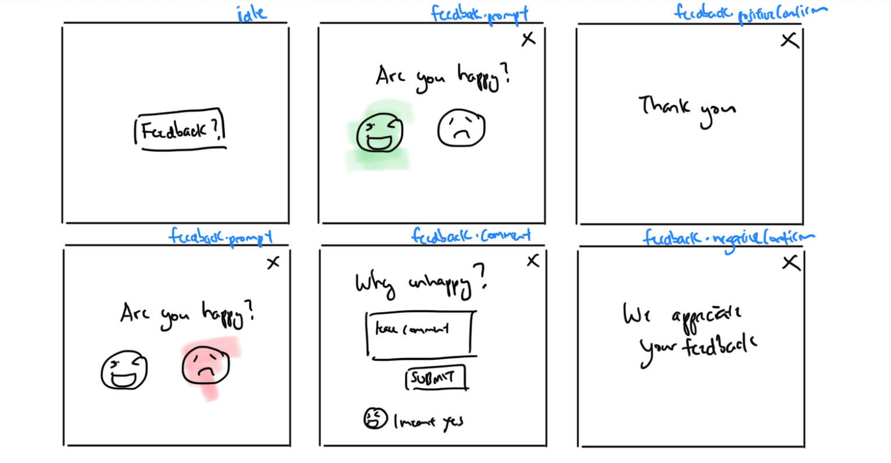
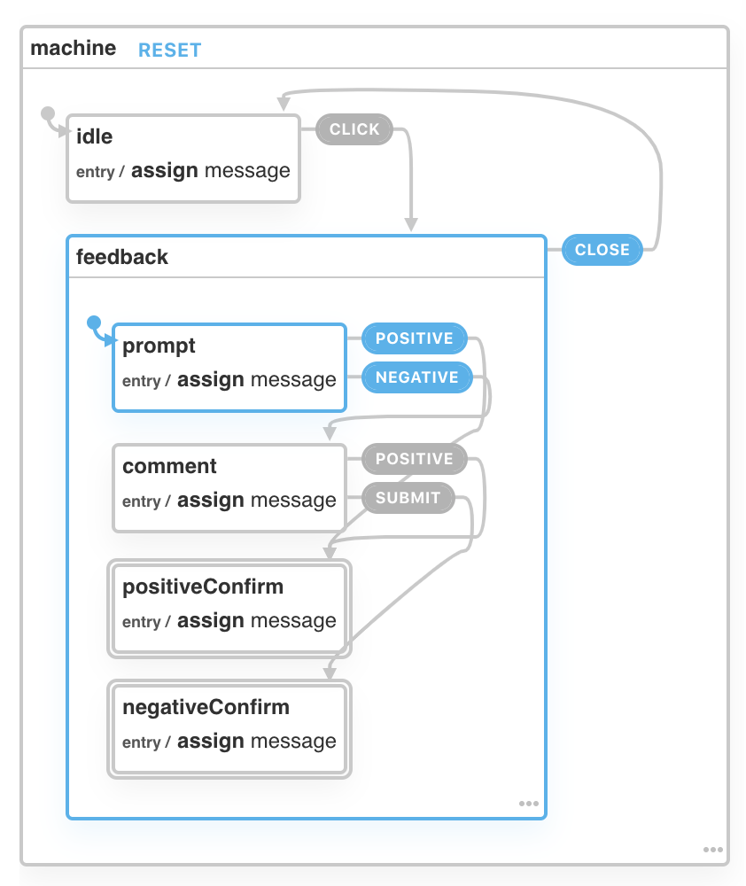

# XState Feedback

Demo link:
http://xstatefeedback.surge.sh/

Feedback UI


XState Chart
https://xstate.js.org/viz/?gist=11767053b613462621964c18ee3441bb


```javascript
const feedbackMachine = Machine({
  id: 'machine',
  initial: 'idle',
  context: {
    message: ""
  },
  states: {
    idle: {
      on: {
        CLICK: 'feedback'
      },
      entry: assign({
        message: ''
      })
    },
    feedback: {
      initial: 'prompt',
      states: {
        prompt: {
          on: {
            POSITIVE: 'positiveConfirm',
            NEGATIVE: 'comment'
          },
          entry: assign({
            message: 'Are you happy?'
          })
        },
        comment: {
          on: {
            POSITIVE: 'positiveConfirm',
            SUBMIT: {
              target: 'negativeConfirm'
            }
          },
          entry: assign({
            message: 'But why?'
          })
        },
        positiveConfirm: {
          type: 'final',
          entry: assign({
            message: 'Thank you'
          })
        },
        negativeConfirm: {
          type: 'final',
          entry: assign({
            message: 'We appreciate your feedback'
          })
        }
      },
      on: {
        CLOSE: 'idle'
      }
    }
  }
});

```