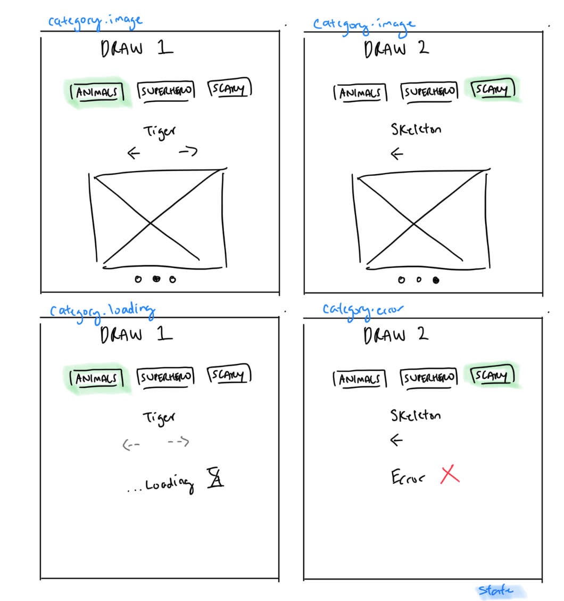

# XState Form

Demo link:
http://xstategallery.surge.sh/

Form UI


XState Chart


XState Machine
```javascript
const increment = assign({
  idx: ctx => ctx.idx + 1
});

const decrement = assign({
  idx: ctx => ctx.idx - 1
});


const updateCategory = assign({
  categoryId: (ctx, evt) => evt.categoryId ? evt.categoryId : ctx.categoryId,
  max: (ctx, evt) => evt.max ? evt.max : ctx.max,
  idx: 0,
  min: 0
})

const GalleryMachine = Machine({
  initial: 'category',
  context: {
    idx: 0,
    min: 0,
    max: 4,
    categoryId: 1
  },
  states: {
    category: {
      initial: 'image',
      states: {
        image: {
          on: {
            NEXT: {
              target: 'loading',
              actions: increment,
              cond: ctx => ctx.idx < ctx.max
            },
            PREV: {
              target: 'loading',
              actions: decrement,
              cond: ctx => ctx.idx > ctx.min
            }
          }
        },
        loading: {
          on: {
            RESOLVE: 'image',
            REJECT: 'error'
          }
        },
        error: {
          on: {
            RETRY: 'loading'
          }
        }
      },
      on: {
        'UPDATE_CATEGORY': {
          target: 'category.loading',
          actions: updateCategory
        }
      }
    }
  }
});

```