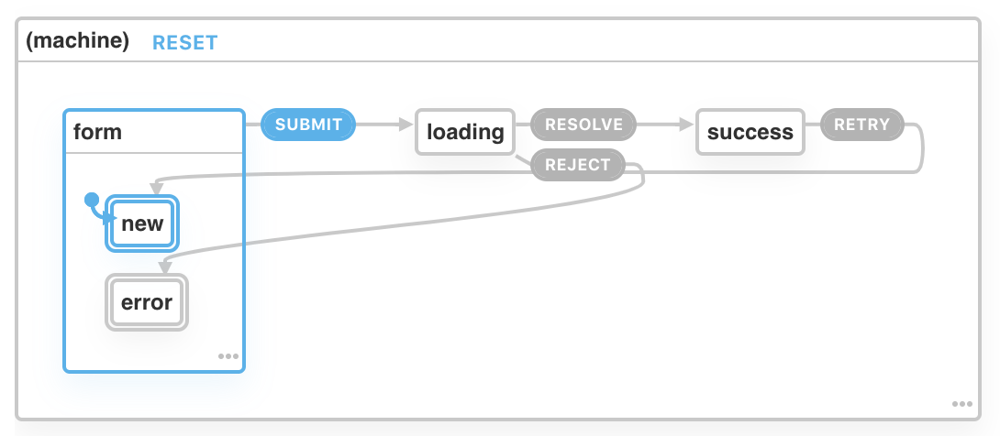
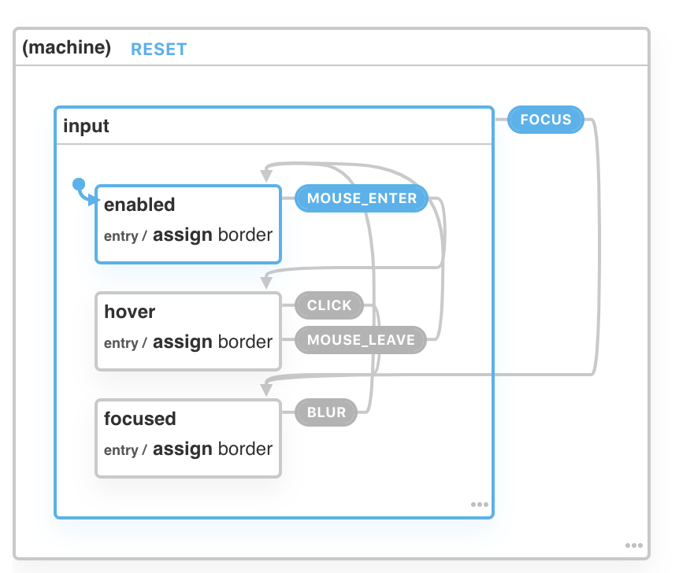

# XState Form with Hooks

Demo link:
http://xstateinput.surge.sh/

XState Form:
https://xstate.js.org/viz/?gist=9c62ae09c3e50256a27a3857878f893a


```javascript
const FormMachine = Machine({
  id: 'form-machine',
  initial: "form",
  states: {
    form: {
      states: {
        new: {
          type: "final"
        },
        error: {
          type: "final"
        }
      },
      initial: "new",
      on: {
        SUBMIT: "loading"
      }
    },
    loading: {
      on: {
        RESOLVE: "success",
        REJECT: "form.error"
      }
    },
    success: {
      on: {
        RETRY: "form.new"
      }
    }
  }
});
```

XState Input:
https://xstate.js.org/viz/?gist=a82cb87b737817564d7aa9143fdd82c1


```javascript
const assignBorderColor = (color) => assign({
  border: `3px solid ${color}`
})

const inputMachine = Machine({
  initial: 'input',
  context: {
    border: '1px solid white'
  },
  states: {
    input: {
      initial: 'enabled',
      context: {
        border: '1px solid white'
      },
      states: {
        enabled: {
          on: {
            'MOUSE_ENTER': 'hover'
          },
          entry: assignBorderColor('black')
        },
        hover: {
          on: {
            'CLICK': 'focused',
            'MOUSE_LEAVE': 'enabled'
          },
          entry: assignBorderColor('blue')
        },
        focused: {
          on: {
            'BLUR': 'enabled'
          },
          entry: assignBorderColor('green')
        }
      },
      on: {
        FOCUS: 'input.focused'
      }
    }
  }
});

```