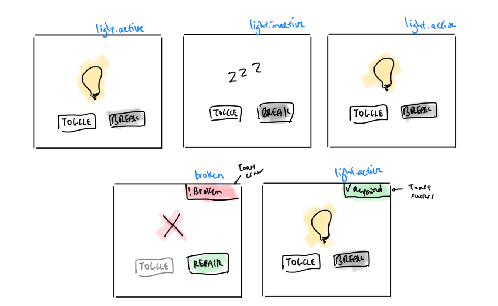
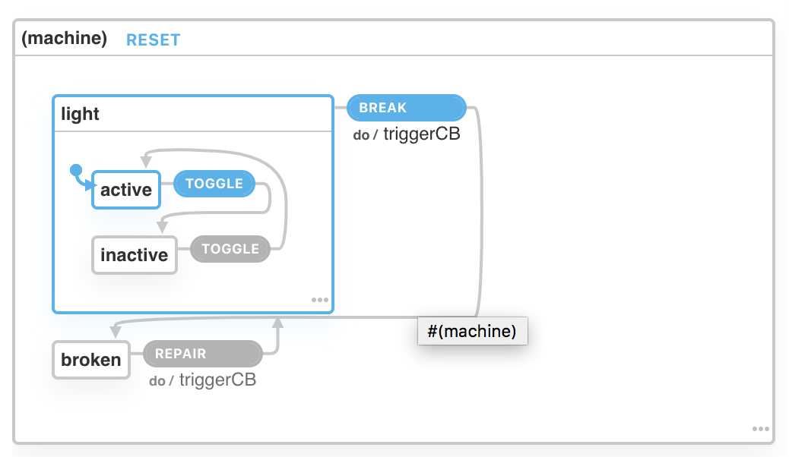

# XState Form Toggle with Toast

Demo link:
http://xstatetoast.surge.sh/

UI:


XState Light:
https://xstate.js.org/viz/?gist=bd97506b065d04c16d2c24727ebfd150


```javascript
const triggerCB = (_ctx, evt) => evt.cb && evt.cb()

const lightMachine = Machine({
  initial: 'light',
  states: {
    light: {
      initial: 'active',
      states: {
        active: {
          on: {
            TOGGLE: 'inactive'
          }
        },
        inactive: {
          on: {
            TOGGLE: 'active'
          }
        }
      },
      on: {
        BREAK: {
          target: 'broken',
          actions: triggerCB
        }
      }
    },
    broken: {
      on: {
        REPAIR: {
          target: 'light',
          actions: triggerCB
        }
      }
    }
  }
});
```