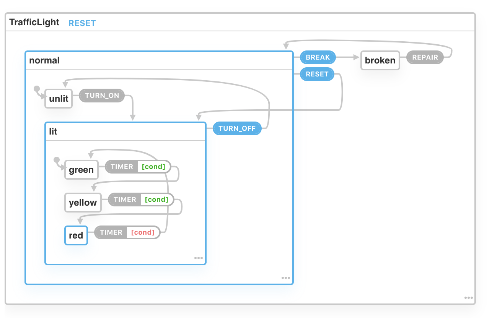

# XState Chart Traffic Lights

Demo link:
http://xstatetrafficlight.surge.sh/

XState Chart



```javascript
const TrafficLightMachine = Machine({
  id: 'TrafficLight',
  initial: "normal",
  states: {
    normal: {
      id: "4270a101",
      initial: "unlit",
      on: {
        BREAK: "broken"
      },
      states: {
        unlit: {
          id: "2a412589",
          on: {
            TURN_ON: "lit"
          }
        },
        lit: {
          id: "89246514",
          initial: "green",
          on: {
            TURN_OFF: "unlit"
          },
          states: {
            green: {
              id: "1ecaaa9d",
              on: {
                TIMER: "yellow"
              }
            },
            yellow: {
              id: "e7da3afc",
              on: {
                TIMER: "red"
              }
            },
            red: {
              id: "4d4c91d2",
              on: {
                TIMER: "green"
              }
            }
          }
        }
      }
    },
    broken: {
      id: "87c05516",
      on: {
        REPAIR: "normal"
      }
    }
  }
});

```